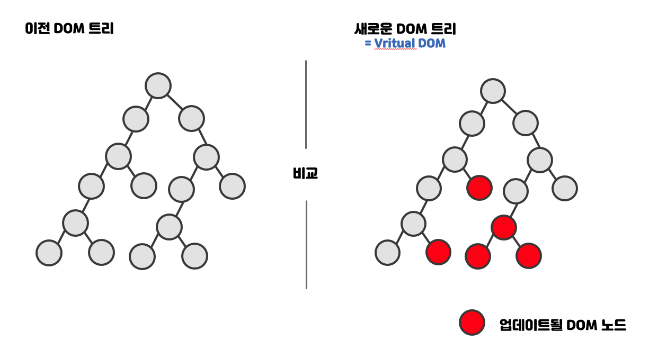

# React Virtual DOM

## Intro

React는 가상의 DOM을 실제 DOM과 비교하여, DOM 조작을 최소화하고 애플리케이션의 성능을 최적화시킬 수 있다. 그러다 생긴 의구심은 비교하는 타이밍이다. 이에 대해서는 컴포넌트 생명주기에 대해 알 필요가 있지만, 이번 내용에서는 가상 DOM과 실제 DOM의 비교 타이밍 및 그 과정의 순서에 대해 기술해보려고 한다.

---

## 비교 타이밍

가상 DOM의 비교는 리액트 컴포넌트의 상태 `state`나 속성 `props`이 변경될 때 발생한다. 이는 다음과 같은 경우에 해당한다.

1. `setState()` 메서드 호출
2. 부모 컴포넌트로부터 새로운 `props` 전달
3. `forceUpdate()` 메서드 호출

### 프로세스

조금 더 자세히 알아보자.

1. 상태 변경: 데이터(`state` 또는 `props`)가 수정됨
2. 렌더링: 리액트는 컴포넌트를 다시 렌더링. 이때 새로운 가상 DOM 트리가 생성
3. 비교: 리액트는 이전 가상 DOM 트리와 새로 생성된 가상 DOM 트리를 비교. 이 과정을 "재조정"이라고 함.
4. 차이점 계산: 두 트리 간의 차이를 계산
5. 실제 DOM 업데이트: 계산된 차이점만 실제 DOM에 적용

따라서, **비교 타이밍은 데이터 수정 직후가 아니라, 데이터 수정으로 인해 리액트가 컴포넌트를 다시 렌더링한 후**입니다. 이 과정은 매우 빠르게 일어나며, 리액트의 효율적인 Diff 비교 알고리즘 덕분에 성능 저하 없이 수행된다.

---

## 랜더링은 가상의 DOM

"컴포넌트를 다시 렌더링"한다는 것은 실제로 화면에 그리는 것이 아니라, 새로운 가상 DOM 트리를 생성하는 것을 의미한다. 이 새로운 가상 DOM 트리는 이전 트리와 비교되고, 그 후에 필요한 변경사항만 실제 DOM에 적용된다.

이러한 과정을 통해 리액트는 아래와 같은 장점을 가질 수 있다.

1. 불필요한 DOM 조작을 최소화
2. 여러 변경사항을 일괄 처리하여 성능 최적화
3. 선언적 UI 프로그래밍 모델을 제공하면서도 효율적인 DOM 업데이트

이 과정은 매우 빠르게 일어나기 때문에, 사용자 입장에서는 거의 즉각적으로 UI가 업데이트되는 것처럼 보인다.

> React(선언형)
>
> > UI가 어떻게 보여야 하는지를 설명
> >
> > 상태(state)를 정의하고, 그 상태에 따라 UI가 어떻게 보일지 선언
>
> JavaScript(명령형)
>
> > 어떻게 UI를 변경할지 단계별로 지시
> >
> > DOM 요소를 직접 선택하고 조작

---

## 첫 번째 랜더링 때는 가상 DOM 실제 DOM

위의 내용을 통해, 리액트는 데이터가 변경될 때, 가상 DOM을 생성하고 기존의 실제 DOM과 비교하여 업데이트시킨다. 그렇다면 여기서 궁금한 점이 생길 수 있다. 처음 랜더링될 때는 가상 DOM이 생성되는가 실제 DOM이 생성되는가?

이에 대한 답은, 가상 DOM이다. 위에서 순서를 설명했지만, 다시 자세히 알아보자.

### 첫 번째 렌더링 과정

- 컴포넌트가 처음 렌더링될 때도 가상 DOM을 사용
- 렌더 단계에서 전체 가상 DOM 트리를 생성
- 이후 이 가상 DOM 트리를 기반으로 실제 DOM을 구성

### 일반 가상 DOM 생성 때와의 차이점

- 첫 렌더링 시에는 이전 가상 DOM 트리가 없으므로 비교(재조정) 과정이 없다.
- 대신, 생성된 전체 가상 DOM 트리를 실제 DOM으로 변환합니다.

### 프로세스

- 가상 DOM 트리 생성
- 실제 DOM 요소 생성 및 삽입
- 생명주기 메서드 호출 (예: componentDidMount)

### 이후 업데이트

- 첫 렌더링 이후의 모든 업데이트는 이전에 설명한 비교 및 부분 업데이트 과정을 따른다.

결과적으로 첫 번째 렌더링에서도 가상 DOM을 사용하지만, 전체 DOM을 새로 구성한다는 점에서 차이가 있다.

---

## Outro

위의 내용들을 요약하면 아래와 같다.

- React는 항상 가상 DOM을 먼저 다루고, 그 다음에 실제 DOM을 조작한다.
- 초기 렌더링에서는 전체 DOM을 구성하지만, 이후 업데이트에서는 변경된 부분만 효율적으로 수정한다.
- 비교 과정은 이전 가상 DOM과 새 가상 DOM 사이에서 이루어진다. 실제 DOM과 직접 비교하지 않는다.

이러한 방식으로 React는 DOM 조작을 최소화하고 애플리케이션의 성능을 최적화시킬 수 있다.
