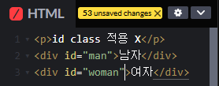
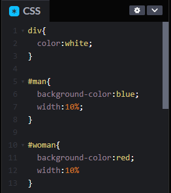
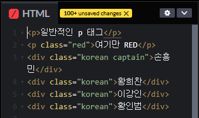
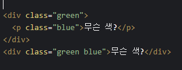
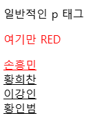
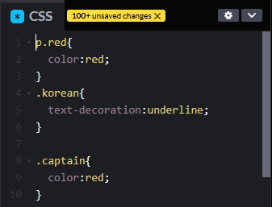
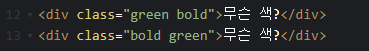
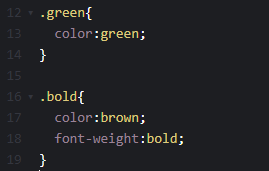
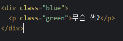
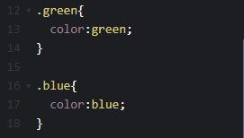

# id와 class

 

id 선택자와 class 선택자는 모두 특정 HTML 요소에 이름을 붙여주어 개별적인 제어가 가능하도록 하는 용도로 사용되지만, 쓰임이 서로 다르다. 두 선택자의 차이점을 비교해보도록 한다.
 

## id 선택자

1. 특징

- 특정 요소 하나를 식별하기 위한 수단으로써 사용한다.
- HTML 문서 내에서 유일하며 단 하나의 요소에 대해서만 지정할 수 있다.
- 하나의 요소에는 단 하나의 id 선택자를 가질 수 있다.

2.  사용법

- 특정 요소 안에 id="값" 형태로 지정한다.
- `

`
- #아이디명{ 스타일 : 값; }

 

 

 

## class 선택자

1. 특징

- 여러 요소에 공통적으로 적용되는 스타일을 정의하는 수단으로 사용한다.
- HTML 문서 내, 여러 요소에 대해 지정할 수 있다.
- 하나의 요소는 여러 class 선택자를 가질 수 있다.

2. 사용법

- 특정 요소 안에 class="값" 형태로 지정한다.
- `

`
- .클래스명{ 스타일 : 값; }
  
  
  
  
  
  

- 같은 요소 중, 특정 요소만 따로 지정할 수도 있다.
  
  

3. 주의사항

- 하나의 요소가 여러 개의 class를 가져 속성이 겹칠 경우, 가장 뒤에 선언된 선택자의 속성을 따른다.
  
  
  
  
  
  
  
  -> 요소 속성 내 선언된 순서와는 상관없이 bold의 내용이 적용된다.

- 속성이 부모-자식 관계일 경우에는 스타일시트의 선언 순서에 관계 없이 자식의 속성으로 대체된다.
  
  
  
  
  
  

 

## 정리

[표]
|구분|id|class|
|---|---|---|
|목적|특정 요소 하나를 식별하는 수단|공통된 스타일을 정의하는 수단 |
|선언기호|#|.|
|다중사용|X|O|
|형태|<요소 id="아이디명">|<요소 class="클래스명">|
